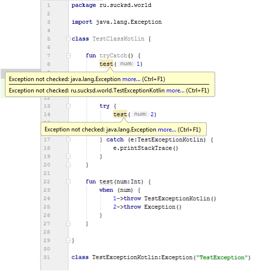

[](https://jitpack.io/#thirdegg/lint-rules)
# Android lint rules

Add to your project ```build.gradle```:

```gradle
allprojects {
    repositories {
        ...
        maven { url 'https://jitpack.io' }
    }
}
```

and to module ```build.gradle```:

```gradle
dependencies {
    ...
    lintChecks('com.github.thirdegg:lint-rules:0.0.5-alpha')
}
```

## Checked Exceptions for kotlin
How it works:


